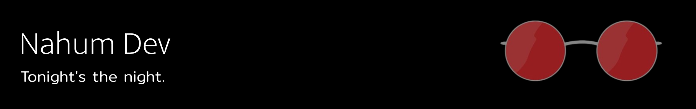

  <ul align="center">
    
<h1 style="display: inline-block">Hi 👋, I'm Nahum!</h1>

  </ul>

<!--- Banner -->

<!--h2 without bottom border-->

  <ul align="center">
    
<h2 style="display: inline-block">About me!</h2>

  </ul>

- 🔭 I’m currently working on **Angular**
  
- 👤 I also have worked with **React, Laravel, MySQL**
  
- 👯 I’m looking forward to collaborate on every kind of projects

- Outside of tech, I enjoy walking 🚶‍♂️, playing video games 🎮, writing novels ✒️, and reading 📖.

- ✔ Ask me about anything, I'm happy to help!

- 📫 Reach out to me at: <a href="nahummejiad@gmail.com">nahummejiad@gmail.com</a>
<!--Intro end-->

<!--h1 without bottom border-->

  <ul align="center">
    
<h2 style="display: inline-block"> Technologies That I Know ⌨️ </h2>

  </ul>

<!--tech stack icons-->

  

<!--end tech stack icons-->
<!-- Connect with me -->
